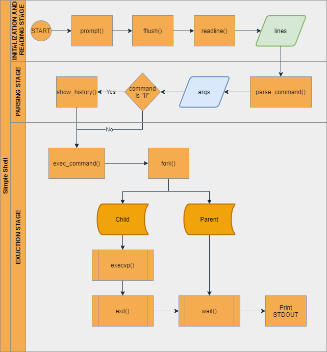

# Operation System Homework 1
## Programming Project for Chap. 3
## Project 1: UNIX Shell and History Feature
This project consists of designing a C program to serve as a shell interface that accepts user commands and then executes each command in a separate process.
- **Part I - Creating a child process to execute a command**
    - The first task is to modify the *main()* function is Fig. 3.35 so that a child process is forked and executes the command specified by the user.
- **Part II - Creating a history feature**
    - The next task is to modify the shell interface program so that it provides a *history* feature that allows the user to access the most recently entered commands.
---
# Idea
## I. Creating and executing command in a Child Process
The first task is to modify the *main()* function so that a child process is forked and executes the command specified by the user. This will require parsing what the user has entered and storing in an array of character strings. Then, this args array will be passed to the execvp() function.

## II. Creating a History Feature
The next task is to modify the shell interface program so that it provides a *history* feature to allow a user to execute the most recent command by entering ***!!***. For example, if a user enters the command !! and then enters ls, he or she can then execute that command again by entering !! at the prompt. 

## III. Infrastructure

---
# Result
## Starting shell and show history
Successfully show previous and execute ls command

## Exectue help, cd, and exit shell

